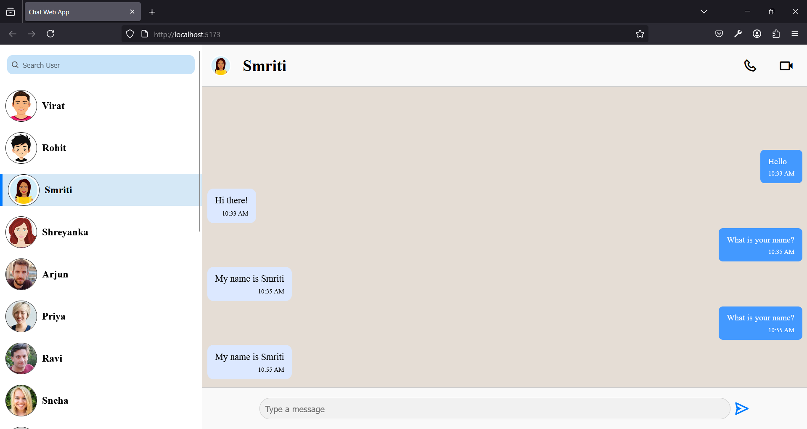

# 💬 Chat Web App

A simple, responsive web-based chat application built with modern web technologies.

## 🚀 Features

- Real-time messaging
- User authentication
- Responsive design for mobile and desktop
- Chat history persistence
- Emoji support

## 🛠️ Technologies Used

- React (Hooks: `useState`, `useEffect`, `useRef`)
- CSS (custom styles)
- LocalStorage (for saving chat per profile)
- Boxicons for icons

## 🖼️ Screenshot

